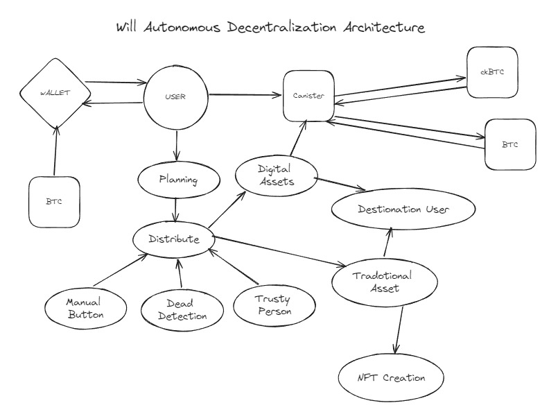

#  Will Autonomous Decentralization
A decentralized platform for creating and executing digital wills—traditional testament. The will will be executed automatically upon death based on certain conditions monitored by smart contracts.
<br><br>
Link Github: https://github.com/fajartd02/wintothemoon

## Background 
Imagine you've spent years building your legacy investing in real estate, collecting rare NFTs, and accumulating cryptocurrencies. You've carefully considered who should inherit these treasures, but the thought of your loved ones getting tangled in a web of legal disputes and endless delays after you're gone is unsettling. Traditional wills, while necessary, often fall victim to lengthy processes and bitter conflicts among beneficiaries, turning what should be a straightforward transition into a frustrating ordeal. <br><br>
Now, picture yourself in the digital age, where your virtual assets those cryptocurrencies, NFTs, and online accounts have become just as valuable as your physical possessions. Yet, despite their worth, you can't help but worry about their fate after you're gone. You're not alone; 89% of cryptocurrency owners share this concern, and shockingly, 23% of them have no plan in place to ensure these assets are passed on. It's a sobering thought, especially when you consider that around 20% of Bitcoin valued at an astounding $140 billion is lost forever due to forgotten private keys or unshared access. <br><br>
These scenarios paint a clear picture of why a modern solution is urgently needed to ensure that both your physical and digital assets are managed and distributed according to your wishes. And now, with our platform, even your traditional testament, detailing real-world assets like cars, motorcycles, and houses, can be securely digitized and turned into an NFT, ensuring that your legacy is preserved and executed exactly as you intended.

## How it Works 
Imagine a future where your digital legacy is seamlessly managed, with every detail executed exactly as you envisioned. Here’s how Will Autonomous Decentralization brings this vision to life:<br><br>
### Step 1: Crafting Your Legacy
Picture yourself sitting comfortably at your computer, carefully planning your digital legacy. You log into our intuitive platform and begin crafting your digital will. With a few clicks, you list all your assets—cryptocurrencies, NFTs, important documents and specify who should receive each item. The platform guides you through each step, making the process simple and straightforward. You add personal messages and instructions, ensuring that every detail reflects your wishes. For your real-world assets, such as cars, motorcycles, and houses, our platform allows you to create a traditional testament. This testament can be handwritten or typed and can even be turned into an NFT for added security and permanence.
### Step 2: Securing Your Keys
Once your will is drafted, the next step is safeguarding your digital assets. Imagine placing the key to a secret vault into several secure safes, each guarded by a trusted friend. Similarly, your decryption keys are split into multiple parts and stored with several trusted trustees. This way, no single person has access to the complete key, ensuring that your assets are protected from unauthorized access and tampering.
### Step 3: Waiting for the Right Moment
Life goes on, and your assets remain secure. The platform continuously monitors your account, ready to spring into action if needed. Imagine your digital will as a well-oiled machine, patiently waiting for the signal to start. The system is programmed to detect when certain conditions are met—such as verifying your death through secure methods or evidence from your trusted trustees.
### Step 4: Automatic Execution
When the time comes, and the system verifies that you are no longer with us, the magic happens. Your digital will is activated by smart contracts, like a conductor cueing an orchestra. The contracts automatically distribute your assets according to your carefully laid-out plans. Your cryptocurrencies are transferred, NFTs are sent to the designated recipients, and personal messages are delivered. For your real-world assets, the traditional testament ensures they are distributed according to your wishes, with the added security of being stored as an NFT if desired. Everything unfolds exactly as you intended, with no delays or disputes.
### Step 5: Ensuring Transparency and Peace of Mind
Throughout this process, every action is recorded on the blockchain, creating a transparent and immutable record. Imagine a crystal-clear window into the process, where every beneficiary can see that the will is being executed fairly and as promised. This transparency provides peace of mind, knowing that your legacy is in good hands and your wishes are being honored without compromise.<br><br>
With Will Autonomous Decentralization, your digital and real-world legacies are managed with precision and care, ensuring that your assets are distributed exactly as you intended, seamlessly and securely.

## Track 
Fully on-chain dApps


## Tech Stack 
  - Motoko Backend
  - React Frontend
  - NFT Contract
  - Custom Token Contract
  - User Auth Internet Identity
  - Secret Sharing
  - Multi-canister application
  - Planning Heritage Distribution Assets
  - Distribution Token & NFT
  -ckBTC Integration 

## Tech Details 
 <br>
$WADT is a token for carrying out operations such as planning and automatic asset distribution. This token is used for operational costs such as storing data and paying transfer fees.<br><br>
Users distribute traditional assets (e.g. land certificates, real-world assets) by creating NFTs on assets and then we distribute them to the intended principal identity. And one example of a digital asset that is distributed is the BTC token which is integrated with ckBTC.<br><br>
If users want to distribute automatically, they will top up our canister, and our canister will carry out automatic distribution. The method is that users transfer to the canister and will be swapped to ckBTC which has a 1:1 ratio with BTC. When the time comes (between when the user dies or presses the button or uses another trusted person) then the token will be distributed to each party.<br><br>
There are 3 ways to distribute: Automation when dying, manual button, and trusty person click the button.<br><br>
For Automation when dying, it will be checked via the heart rate on the smartwatch. If the heart rate is 0 and the status is online for more than 24 hours. This is categorized as death and will automate the distribution of assets according to the plan given.<br><br>
The second way is that the user can distribute using the button on the user dashboard.<br><br>
The third way is a person trusted by the user (must be more than 1 person), when someone identifies death, at least 50% (majority vote) agree, then the assets will be distributed.

## How to Run in Local 
  1. Install dfx version 0.22 in your local computer
  2. Running dfx in your terminal ```dfx start```
  3. Deploy your canister in terminal ```dfx deploy```
  4. You will get the link in the terminal for the backend candid interface & frontend URL. For example: ```http://cbopz-duaaa-aaaaa-qaaka-cai.localhost:4943/``` (Frontend) and  ``` http://127.0.0.1:4943/?canisterId=cpmcr-yeaaa-aaaaa-qaala-cai&id=cinef-v4aaa-aaaaa-qaalq-cai``` (Backend).

## Deployed Canisters 
### Mainnet URLs: <br/>
  Frontend canister via browser
    wadt_frontend: https://hlihp-laaaa-aaaak-ak24q-cai.icp0.io/ <br/> <br/>
  Backend canister via Candid interface: <br/> 
    operational_contract: https://a4gq6-oaaaa-aaaab-qaa4q-cai.raw.icp0.io/?id=hmjb3-gyaaa-aaaak-ak24a-cai <br/>
  wadt_token_contract: https://a4gq6-oaaaa-aaaab-qaa4q-cai.raw.icp0.io/?id=hclmt-5iaaa-aaaak-ak25a-cai

## Team Participants 
  1. Fajar Muhammad Hamka
     - GitHub: fajartd02
     - Discord: fajarmh
     - ICP Principal: h5h2y-c2kn6-dlhab-3xujs-a7qpx-xin6q-sjdde-34ipk-h3eyb-nnsgd-nqe
  2. Alvian Daru Quthni
     - GitHub: Alviannn
     - Discord: alviandq
     - ICP Principal: oqlgu-pd7ov-tam6m-xoon6-l6uim-g4gtt-7flcg-bs56g-svah7-dtaru-nqe
  3. Vanessa Aurellia 
     - GitHub: vanessaaurellia
     - Discord: vanessaaurellia
     - ICP Principal: sg3r5-joeyb-7hacx-uy753-prfq3-2fkmx-sx5k5-2fk72-n4hb6-opumv-tae
  4. Leonardo
     - GitHub: leonardo-lim
     - Discord: icyfurze
     - ICP Principal: arwj4-rylau-gl3q5-bm4sb-grsxz-6y2dh-jy4ll-uelfh-frmfp-j7vvg-jqe

## Feedback 
### What have we learned?
  - Learning concept about how to integrate or send coin such as Bitcoin into another user for example ckBTC
  - Learning web3 concept and the edge case such as upgrade deployment
  - Learning how to integrate frontend and smart contract with auth or without auth
  - Learning about deployment web3
### What were the challenges we ran into?
  - Integrating with the ckBTC
  - Possibly outdated or incorrect documentation
  - Standardization of NFT & Token
  - Algorithmic Efficiency Data
  - Error syntax Motoko
  - Authentication concept & identity concept (there are a lot, like anonymous identity, auth identity, command line identity)
  - Thinking about edge case smart contracts
  - Think about a good ideation
### What are we proud of?
  - Ideation
  - Custom Token
  - NFT Smart Contract
  - Authentication
  - Learning ckBTC Integration


